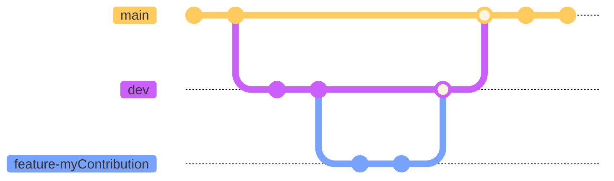

# Mex Technical Documentation

[Documentation link](https://mex-data-science.github.io/mex-technical-documentation/)

Contents:
* [General Contributions](#general-contributions)
* [Local Environment](#local-environment)

## General Contributions

Acknowledge the `dev` branch of this repository is designated for general
contributions. It serves as a central point where collaborators can add
features, fix bugs, and make improvements that are not specific to any other
branch.

This branch ensures that all general updates and enhancements are organized and
easily accessible for integration into the main documentation.

### Version control for general changes

Please attach to the branching guideline bellow:



## Local environment

Once you completed a documentation section, ensure everything works as intended
by running the docs site locally.

Prerequisites:

* [Git](https://git-scm.com/downloads/win)
* [Python](https://www.python.org/downloads/)
* [Miniconda](https://www.anaconda.com/docs/getting-started/miniconda/install#windows-installation)
* Suggested IDE: [Visual Studio Code](https://code.visualstudio.com/)

Installation:

1. Open a miniconda terminal
2. Clone the source repository
3. Navigate to the repository
4. Create the pre-built env, this creates a `docs` conda environment
    ```sh
    conda env create --file environment.yml
    ```
5. Activate `docs` env
    ```sh
    conda activate docs
    ```
6. Launch the docs site locally
    ```sh
    mkdocs serve
    ```
7. Open the site serving URL in a web browser
