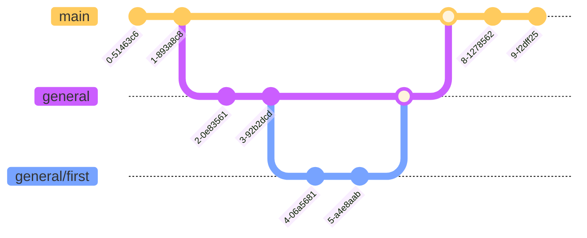

# Mex Technical Documentation

[Documentation link](https://macastanedacsa.github.io/mex-technical-documentation/)

## General Contributions

Acknowledge the `general` branch of this repository is designated for general
contributions. It serves as a central point where collaborators can add
features, fix bugs, and make improvements that are not specific to any other
branch.

This branch ensures that all general updates and enhancements are organized and
easily accessible for integration into the main documentation.

### Version control for general changes

Please attach to the branching guideline bellow:

