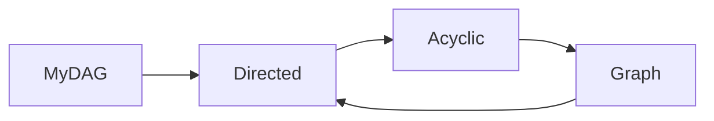
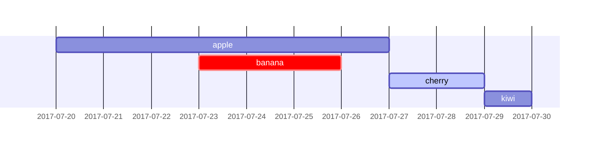

# Tools

This section is a collection of the current tools used by the L'Oréal Mex Data
Science Team.

---
## Drawio

!!! tip
    Use `drawio` for complex diagrams.

[Drawio](https://www.drawio.com/doc/faq/new-diagram) is a free online diagrams
tool that supports a wide range of diagrams with its extensive shape libraries.
It allows to create diagrams with point and click functionalities.

It is the primary tool for diagramming due to its built-in integration with
several storage locations (GitHub in particular), which allows you to edit any
diagram straight out from the storage source. For example:

* GitHub
* OneDrive
* Local device

It is extremly useful to integrate cloud icons into a diagram, such as:

* Databricks
* Amazon Web Services
* Google Cloud Storage
* Microsoft Azure

And it allows you to export a diagram to common image formats like JPEG or PNG.

---
## Mermaid

!!! tip
    Use `mermaid` functionalities for markdown in-file diagrams. Avoid usage
    for more complex visualizations.

[Mermaid](https://mermaid.js.org/intro/) lets you create diagrams and
visualizations using text and code. It counts with a [live editor](https://mermaid.live/edit)
so you can design a graph before its inclusion to the documentation.

It is particularly usefull for its plugin functionalities to markdown files,
for example:

```code
graph LR
	MyDAG --> Directed
	Directed --> Acyclic
	Acyclic --> Graph
	Graph --> Directed
```



Or more advanced charts:

```code
gantt
	apple   :a, 2017-07-20, 1w
	banana  :crit, b, 2017-07-23, 3d
	cherry  :active, c, after b a, 2d
	kiwi    :d, after c, 1d
```


---
