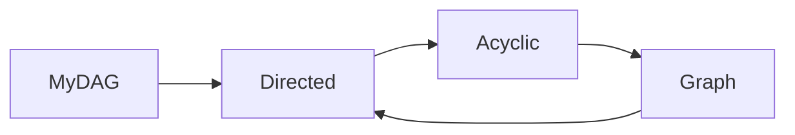
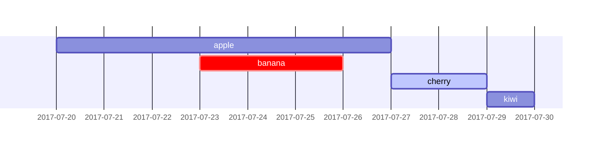

# Tools

This section is a collection of the current tools used by the L'Oréal Mex Data
Science Team.

## Drawio

[Drawio]()

---

## Mermaid

!!! tip
    Use `mermaid` functionalities for markdown in-file diagrams. Avoid usage
    for more complex visualizations.

[Mermaid](https://mermaid.js.org/intro/) lets you create diagrams and
visualizations using text and code. It counts with a [live editor](https://mermaid.live/edit)
so you can design a graph before its inclusion to the documentation.

It is particularly usefull for its plugin functionalities to markdown files,
for example:

or more advanced charts:

---
